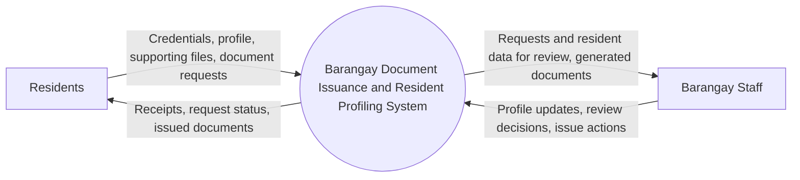
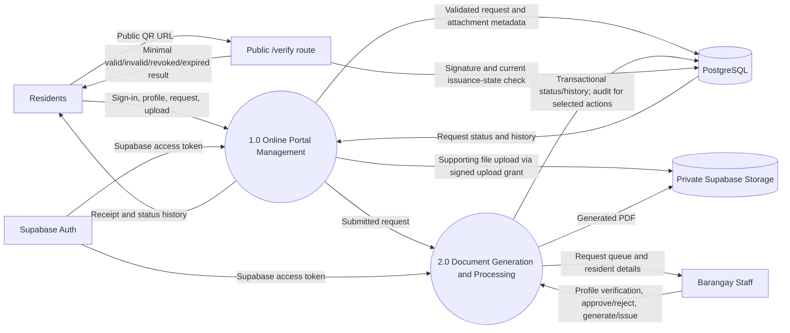

# Barangay Document Issuance and Resident Profiling System
## As-Built Architecture, Database Design, and Agile Plan

**Project:** Barangay Document Issuance and Resident Profiling System with Online Request and QR Verification  
**Status:** Direct Vercel Production deployment is live. Core routes respond, but production workflow acceptance and operational sign-off are still pending.  
**Last updated:** 2026-09-30  
**Scope:** Barangay Clearance, Barangay ID, and Certificate of Residency

## Implementation Snapshot

The running application is a Next.js 16 App Router application using React 19, Supabase Auth, PostgreSQL, and Supabase Storage. The seven ordered SQL migrations under `web/src/lib/db/migrations` are the current database source of truth. The original design below has been reconciled where noted; proposed backlog items remain goals, not claims of shipped functionality.

**Implemented and locally validated:** resident email-confirmed registration and sign-in; resident profile save; document request creation and history; signed attachment upload intents with server-side file verification; staff queue, profile verification, review with transactional audit events, approval, PDF issuance, and audited document revocation; resident in-app notifications for submission, review, profile verification, issuance, and revocation, with resident-owned read/unread state; QR HMAC verification with retained-key support and scan logging; resident-owned PDF download through a short-lived signed URL; guarded provisioning scripts; QR and route tests; PostgreSQL integration tests for ownership, queue paging/search, notification ownership/read state, review/revocation audit, and QR revoked status; and a GitHub Actions CI workflow. Route tests mock Postgres and Storage. Provisioning refusal/confirmation paths were checked, but no live role change was performed and the hosted CI workflow has not yet had a remote run.

**Not yet implemented or production-verified:** email/SMS status notifications; jurisdiction scoping; an admin UI; a reissue workflow; key-retirement/compromise procedures; application-level rate limiting beyond Supabase Auth controls; malware scanning; automated orphan-file cleanup; Supabase Auth/Storage integration tests; browser end-to-end tests; automated production migration execution; backup-restore rehearsal; and privacy/retention approval. Staff assignment enforcement with an admin override is implemented and covered by a PostgreSQL integration test. The queue uses 25-row pages with status filtering and receipt/resident-name search. Current workspace checks pass for lint, typecheck, and production build; the current test run has 24 passing tests and 8 skipped PostgreSQL integration tests because no disposable `TEST_DATABASE_URL` is configured. Hosted CI and production business workflows still need verification.

## 1. Scope and Assumptions

The system replaces paper-based resident profiling and document-request tracking with a resident portal and a staff processing workflow. Residents register, maintain their profile, submit supporting files and requests, and track receipts and status history. Authorized barangay staff review requests and profiles, approve or reject applications, generate and issue documents, and verify issued documents. Initial administrator and staff provisioning is operator-controlled; there is no admin UI.

Financial accounting, payroll, inventory, and blotter/Lupon Tagapamayapa records are explicitly excluded. The system does not collect fees or represent QR verification as a digital signature or proof of identity. Final document approval and issuance remain the responsibility of authorized barangay staff.

Policy decisions to confirm with the Product Owner before production acceptance:

- A resident account represents one person; public registration creates resident roles only. The first admin is bootstrapped by an operator-controlled script, and an active admin can promote a confirmed resident to staff through a guarded, audited script.
- The barangay uses one configured jurisdiction and one managed PostgreSQL database.
- The resident request center shows in-app notifications for request submission, review decisions, profile verification, issuance, and revocation. Email/SMS require a later provider, privacy, and cost decision.
- A QR verification page reveals only the minimum public document details approved by the barangay.
- Applicable Philippine privacy, records-retention, and barangay document requirements must be reviewed with the adviser/Barangay Secretary; this design does not substitute for legal review.

## 2. System Architecture

### 2.1 Logical components

| Component | Responsibility | Trust boundary |
|---|---|---|
| Next.js App Router (Next.js 16, React 19) | Resident/staff UI, Route Handlers, validation, authorization, SQL transactions, PDF generation, verification page | Publicly reachable; all inputs are untrusted. A direct Vercel Production deployment is live; HTTP smoke checks pass, while end-to-end business acceptance remains open |
| Supabase Auth | Email/password identity lifecycle, email confirmation, and access-token issuance | Identity provider; it does not grant application roles |
| Supabase server/admin clients | Validate access tokens; create short-lived Storage upload/download grants; perform operator-only account provisioning | Server-only; service-role credentials stay in server environment variables |
| PostgreSQL | Application roles, resident profiles, requests, attachment metadata, status history, issued documents, QR logs, audit events | Authoritative source for application role and workflow state; accessed through parameterized SQL |
| Supabase Storage | Private supporting uploads and issued PDFs | Files use server-created signed upload grants, server-side finalization, and short-lived signed downloads; public access must remain disabled |
| Browser | Supabase Auth sign-in, portal/staff screens, signed upload PUT, download action, QR verification | Untrusted client; never receives database credentials, service-role key, or QR signing secret |

### 2.2 Level 0 DFD (context)



### 2.3 Level 1 DFD (processes and stores)



  **Data-store ownership:** PostgreSQL is authoritative for user roles, profiles, requests, status, issuance, and revocation state. Supabase Auth is authoritative only for identity. Supabase Storage holds file bytes; PostgreSQL holds object paths, ownership, integrity metadata, and lifecycle state. A file's existence in Storage alone never makes a request approved or a document valid.

### 2.4 Request and processing flow

1. A resident signs up/signs in through Supabase Auth. Email confirmation is required before the application links the identity to a resident account. The browser sends the Supabase access token as a Bearer token to protected Route Handlers.
2. The server verifies the access token with Supabase Auth (`auth.getUser`), then loads `app_users` by `auth_user_id` and enforces active state and role from PostgreSQL. Public registration creates resident accounts only; roles are never accepted from the client.
3. A resident creates/updates their profile and submits a typed request. The API validates all fields and allowed document type, checks required profile values, and creates the request, initial status-history event, and receipt identifier in a SQL transaction.
4. For an attachment, the API creates a pending metadata/upload-intent record and server-generated path, then issues a signed Supabase Storage upload grant. Files are limited to five per request, 3 MiB each, and PDF/JPEG/PNG. A finalize endpoint checks ownership, declared size/type, and file signature, computes SHA-256, moves the object to its final prefix, then marks the attachment uploaded.
5. Active staff/admin accounts can view the staff queue and review requests. The queue supports status filtering, receipt/resident-name search, and 25-row server-side pagination with a total count. Staff see unassigned requests and requests assigned to them; admins can manage all requests. Assignment checks cover queue, detail, review, attachment, profile verification, issuance, and revocation paths. Jurisdiction scoping is not implemented. Review transitions, status history, review audit events, and resident notifications are committed in one transaction. Profile verification and issuance are also audited and notify the resident.
6. On approval, the service renders a PDF from a snapshot, stores it privately, computes a SHA-256 digest over the snapshot, creates a serial, and signs QR claims with HMAC-SHA-256. It inserts the issued-document row, marks the request issued, writes status history and an audit event in a SQL transaction. The Storage upload occurs before the transaction; automated orphan reconciliation is not implemented.
7. A resident can request a download only for their own non-revoked issued document. The server returns a Supabase signed URL with a 60-second lifetime. Issued PDFs must remain private.
8. A QR scan opens `/verify/[documentId]` with a signed token. The public route validates the signature and compares claims with the current SQL record, checks expiry/revocation state, logs the result and returns only document type, serial, issue date, and expiry. Staff can revoke an issued document with a required reason; the operation updates the current issuance state and writes an audit event, and repeated revocation is rejected. Verification accepts the active key and explicitly configured retained keys; key retirement/compromise policy, reissue workflow, and rate limiting remain open.

## 3. SQL Database Schema (PostgreSQL)

The deployed schema is defined by the ordered migrations in `web/src/lib/db/migrations` (`0001` through `0007`), not by this document. The block below is a logical schema reference aligned to the current core tables; `auth_user_id` replaces the original `firebase_uid` through migration `0005`, issuance/audit tables are added in `0006`, and in-app notifications are added in `0007`. All timestamps are UTC (`timestamptz`). UUIDs are opaque identifiers; request numbers are not access-control secrets.

```sql
CREATE EXTENSION IF NOT EXISTS pgcrypto;

CREATE TYPE app_role AS ENUM ('resident', 'staff', 'admin');
CREATE TYPE document_type AS ENUM ('barangay_clearance', 'barangay_id', 'certificate_of_residency');
CREATE TYPE request_status AS ENUM (
  'submitted', 'under_review', 'needs_information', 'approved',
  'rejected', 'generating', 'ready_for_issuance', 'issued', 'cancelled'
);
CREATE TYPE attachment_status AS ENUM ('pending_upload', 'uploaded', 'rejected', 'deleted');
CREATE TYPE verification_result AS ENUM ('valid', 'invalid_signature', 'not_found', 'revoked', 'expired', 'mismatch');

CREATE TABLE app_users (
  id              uuid PRIMARY KEY DEFAULT gen_random_uuid(),
  auth_user_id    text NOT NULL UNIQUE,
  role            app_role NOT NULL DEFAULT 'resident',
  email           text,
  display_name    text NOT NULL,
  is_active       boolean NOT NULL DEFAULT true,
  created_at      timestamptz NOT NULL DEFAULT now(),
  updated_at      timestamptz NOT NULL DEFAULT now(),
  CHECK (length(auth_user_id) > 0)
);

CREATE TABLE resident_profiles (
  user_id             uuid PRIMARY KEY REFERENCES app_users(id) ON DELETE RESTRICT,
  first_name          text NOT NULL,
  middle_name         text,
  last_name           text NOT NULL,
  suffix              text,
  birth_date          date NOT NULL,
  civil_status        text,
  contact_number      text,
  house_street        text NOT NULL,
  purok_sitio         text,
  barangay            text NOT NULL,
  municipality        text NOT NULL,
  province            text NOT NULL,
  postal_code         text,
  profile_verified_at timestamptz,
  verified_by         uuid REFERENCES app_users(id) ON DELETE RESTRICT,
  created_at          timestamptz NOT NULL DEFAULT now(),
  updated_at          timestamptz NOT NULL DEFAULT now(),
  CONSTRAINT resident_profile_names_nonempty CHECK (
    length(trim(first_name)) > 0 AND length(trim(last_name)) > 0
  ),
  CONSTRAINT resident_profile_address_nonempty CHECK (
    length(trim(house_street)) > 0
    AND length(trim(barangay)) > 0
    AND length(trim(municipality)) > 0
    AND length(trim(province)) > 0
  )
);

CREATE TABLE document_requests (
  id                  uuid PRIMARY KEY DEFAULT gen_random_uuid(),
  request_number      text NOT NULL UNIQUE,
  resident_user_id    uuid NOT NULL REFERENCES app_users(id) ON DELETE RESTRICT,
  document_type       document_type NOT NULL,
  status              request_status NOT NULL DEFAULT 'submitted',
  purpose             text NOT NULL,
  additional_data     jsonb NOT NULL DEFAULT '{}'::jsonb,
  submitted_at        timestamptz NOT NULL DEFAULT now(),
  assigned_to         uuid REFERENCES app_users(id) ON DELETE RESTRICT,
  reviewed_at         timestamptz,
  decision_note       text,
  completed_at        timestamptz,
  created_at          timestamptz NOT NULL DEFAULT now(),
  updated_at          timestamptz NOT NULL DEFAULT now(),
  CONSTRAINT request_purpose_nonempty CHECK (length(trim(purpose)) > 0),
  CONSTRAINT request_additional_data_object CHECK (jsonb_typeof(additional_data) = 'object')
);

CREATE TABLE request_attachments (
  id                  uuid PRIMARY KEY DEFAULT gen_random_uuid(),
  request_id          uuid NOT NULL REFERENCES document_requests(id) ON DELETE RESTRICT,
  uploaded_by         uuid NOT NULL REFERENCES app_users(id) ON DELETE RESTRICT,
  storage_object_path text NOT NULL UNIQUE,
  original_filename   text NOT NULL,
  content_type        text NOT NULL,
  byte_size           bigint,
  sha256_hex          char(64),
  storage_generation  text,
  status              attachment_status NOT NULL DEFAULT 'pending_upload',
  uploaded_at         timestamptz,
  created_at          timestamptz NOT NULL DEFAULT now(),
  CONSTRAINT attachment_size_positive CHECK (byte_size IS NULL OR byte_size > 0),
  CONSTRAINT attachment_sha256_format CHECK (sha256_hex IS NULL OR sha256_hex ~ '^[0-9a-f]{64}$')
);

CREATE TABLE request_status_history (
  id              bigserial PRIMARY KEY,
  request_id      uuid NOT NULL REFERENCES document_requests(id) ON DELETE RESTRICT,
  from_status     request_status,
  to_status       request_status NOT NULL,
  changed_by      uuid REFERENCES app_users(id) ON DELETE RESTRICT,
  change_note     text,
  changed_at      timestamptz NOT NULL DEFAULT now()
);

CREATE TABLE issued_documents (
  id                      uuid PRIMARY KEY DEFAULT gen_random_uuid(),
  request_id              uuid NOT NULL REFERENCES document_requests(id) ON DELETE RESTRICT,
  version                 integer NOT NULL,
  serial_number           text NOT NULL UNIQUE,
  document_type           document_type NOT NULL,
  issued_to_display_name  text NOT NULL,
  issued_at               timestamptz NOT NULL,
  expires_at              timestamptz,
  storage_object_path     text NOT NULL UNIQUE,
  content_sha256_hex      char(64) NOT NULL,
  content_snapshot        jsonb NOT NULL,
  verification_key_id     text NOT NULL,
  qr_signature_hex        char(64) NOT NULL,
  is_revoked              boolean NOT NULL DEFAULT false,
  revoked_at              timestamptz,
  revoked_by              uuid REFERENCES app_users(id) ON DELETE RESTRICT,
  revocation_reason       text,
  issued_by               uuid NOT NULL REFERENCES app_users(id) ON DELETE RESTRICT,
  created_at              timestamptz NOT NULL DEFAULT now(),
  CONSTRAINT issued_document_version_positive CHECK (version > 0),
  CONSTRAINT issued_document_content_hash_format CHECK (content_sha256_hex ~ '^[0-9a-f]{64}$'),
  CONSTRAINT issued_document_signature_format CHECK (qr_signature_hex ~ '^[0-9a-f]{64}$'),
  CONSTRAINT issued_document_expiry_after_issue CHECK (expires_at IS NULL OR expires_at > issued_at),
  CONSTRAINT issued_document_revocation_consistency CHECK (
    (is_revoked AND revoked_at IS NOT NULL AND revoked_by IS NOT NULL)
    OR (NOT is_revoked AND revoked_at IS NULL AND revoked_by IS NULL)
  ),
  UNIQUE (request_id, version)
);

CREATE TABLE qr_verification_logs (
  id                      bigserial PRIMARY KEY,
  issued_document_id      uuid REFERENCES issued_documents(id) ON DELETE SET NULL,
  scanned_document_id     uuid NOT NULL,
  result                  verification_result NOT NULL,
  scanned_at              timestamptz NOT NULL DEFAULT now(),
  requester_ip_hash       char(64),
  user_agent_summary      text,
  CONSTRAINT qr_log_ip_hash_format CHECK (requester_ip_hash IS NULL OR requester_ip_hash ~ '^[0-9a-f]{64}$')
);

CREATE TABLE in_app_notifications (
  id          uuid PRIMARY KEY DEFAULT gen_random_uuid(),
  user_id     uuid NOT NULL REFERENCES app_users(id) ON DELETE RESTRICT,
  request_id  uuid REFERENCES document_requests(id) ON DELETE RESTRICT,
  event_type  text NOT NULL,
  message     text NOT NULL,
  read_at     timestamptz,
  created_at  timestamptz NOT NULL DEFAULT now()
);

CREATE TABLE audit_events (
  id              bigserial PRIMARY KEY,
  actor_user_id   uuid REFERENCES app_users(id) ON DELETE RESTRICT,
  action          text NOT NULL,
  entity_type     text NOT NULL,
  entity_id       uuid,
  details         jsonb NOT NULL DEFAULT '{}'::jsonb,
  occurred_at     timestamptz NOT NULL DEFAULT now(),
  CONSTRAINT audit_details_object CHECK (jsonb_typeof(details) = 'object')
);

CREATE INDEX document_requests_resident_created_idx
  ON document_requests (resident_user_id, created_at DESC);
CREATE INDEX request_attachments_request_idx
  ON request_attachments (request_id, status);
CREATE INDEX request_status_history_request_idx
  ON request_status_history (request_id, changed_at DESC);
CREATE INDEX issued_documents_request_idx
  ON issued_documents (request_id, version DESC);
CREATE INDEX qr_verification_logs_scanned_at_idx
  ON qr_verification_logs (scanned_at DESC);
CREATE INDEX in_app_notifications_user_created_idx
  ON in_app_notifications (user_id, created_at DESC);
CREATE INDEX in_app_notifications_user_unread_idx
  ON in_app_notifications (user_id, created_at DESC) WHERE read_at IS NULL;
CREATE INDEX audit_events_entity_idx
  ON audit_events (entity_type, entity_id, occurred_at DESC);
```

### 3.1 Data and transaction rules

- The authenticated Supabase user ID is mapped to `app_users.auth_user_id`; clients cannot choose or change `role`, `is_active`, `assigned_to`, decision fields, issuance fields, or storage paths.
- The resident's request ownership is checked in SQL on every read/write. Do not rely on UUID secrecy.
- `additional_data` is for narrowly scoped, document-type-specific request fields only. Validate it with a strict server-side schema and reject unknown keys; do not use it as a substitute for relational columns or place passwords/secrets in it.
- `request_status_history` is written with request creation and staff review transitions. Staff review transitions write an actor-attributed `document_request.reviewed` event and a resident notification in the same transaction. Submission, profile verification, issuance, and revocation also create resident notifications in their respective transactions. The database does not enforce append-only access. Reopening and reissue need explicit audited workflows.
- The schema supports multiple `issued_documents` versions and revocation state. Revocation updates the issued row and appends an audit event without deleting the record; a reissue workflow must preserve prior rows and clearly define which version is current.
- No destructive cascading delete is used for records needed for audit/retention. Implement retention and anonymization under a barangay-approved policy. Restrict direct table access and use parameterized SQL or a typed query builder.
- Store only necessary personal data. Do not log ID tokens, passwords, full document contents, signed upload URLs, or full QR tokens. Hash IP addresses with a rotating server-side key if scan-abuse investigation is necessary; set a retention period for scan and audit logs.
- Production migrations should be versioned and reviewed. Add database-level row-level security only if the selected connection/pooling model supports it reliably; application authorization remains mandatory either way.

## 4. Authentication, Authorization, and Storage Security

### 4.1 Supabase token validation and RBAC

1. Supabase Auth handles sign-up/sign-in and issues access tokens. Email confirmation is required before resident account linking. The browser sends the access token as a Bearer token to protected Route Handlers.
2. Server code verifies the token by calling Supabase Auth `auth.getUser(accessToken)`. It then maps the Supabase user ID to `app_users.auth_user_id` and checks active status and application role in PostgreSQL. Do not rely on client-side role state.
3. Public registration creates resident accounts only. `scripts/bootstrap-first-admin.js` is a one-time, operator-confirmed bootstrap; `scripts/promote-staff-user.js` requires an authenticated active admin token and can promote a resident to staff only. Neither script is an admin UI.
4. Resident endpoints enforce ownership in SQL. Staff queue/detail and mutation paths enforce `assigned_to`; admins have an all-requests override. Jurisdiction scoping is not implemented. Resident in-app notification list/read endpoints are implemented; external email/SMS status notifications are not.
5. Route Handlers use runtime Zod validation and parameterized SQL. Bearer-token authorization is in place, but rate limiting, origin checks, and broader abuse controls are not implemented and remain release work.
6. PostgreSQL is the source of truth for roles. No Supabase custom claims are used for authorization.

### 4.2 Storage controls

- Keep the Supabase Storage bucket private. Supporting uploads use random server-generated paths under `staging/`, signed upload grants, a five-file/request and 3 MiB/file limit, and an allowlist of PDF/JPEG/PNG. Finalization checks ownership, byte size, MIME declaration, and file signature, computes SHA-256, then moves the object under `supporting/`.
- Issued PDFs are stored under `issued/` in the same configured bucket. Resident downloads recheck ownership and revocation state and return a 60-second signed URL. Signed URLs are bearer credentials: do not log or persist them.
- Malware scanning/quarantine is not implemented. Orphaned upload/issuance object cleanup is not automated. Keep the bucket private and test anonymous access as a release gate.
- Supabase service-role, database, and QR signing secrets must remain server-only. Server modules importing privileged clients use `server-only`; never prefix secrets with `NEXT_PUBLIC_`. The existing `konekbarangay` Vercel project has a direct Production deployment; production migrations, private Storage behavior, and resident/staff workflows still require end-to-end verification.

### 4.3 Additional operational security

**Release requirements, not yet verified:** configure production SMTP and size signup/email rate limits against the expected registration surge; enforce HTTPS at the chosen host; configure and test security headers/CSP; add abuse controls to signup, uploads, and public verification; restrict preview deployments to non-production data; configure least-privilege database/service credentials; enable backups and rehearse restoration; establish monitoring, incident contacts, retention/privacy approval, and secret-rotation procedures. Use synthetic data in demos.

## 5. PDF and QR Code Verification

### 5.1 Issuance workflow

1. Staff opens an approved request and confirms profile/request data. The backend records a finalized document-data snapshot or deterministic fields needed to reconstruct the document; later profile edits must not silently alter an already issued document.
2. Render a PDF using `@react-pdf/renderer` (preferred for structured React layouts) or `jsPDF`. Keep templates versioned and approved. Generate the serial number and an opaque `issued_documents.id` on the server.
3. The current issuer computes `content_sha256_hex` over `JSON.stringify(content_snapshot)`, not over the final PDF bytes. The snapshot includes a template version and the approved request/profile fields. This is deterministic for the current constructed object, but there is no separately versioned canonicalization protocol; define one before changing serialization or introducing additional issuers.
4. Construct a canonical claims payload, for example:

```json
{
  "v": 1,
  "kid": "qr-2026-01",
  "documentId": "opaque-uuid",
  "serial": "BRGY-2026-...",
  "type": "certificate_of_residency",
  "issuedAt": "2026-09-30T09:00:00Z",
  "expiresAt": null,
  "contentSha256": "64-lowercase-hex-characters"
}
```

5. The current implementation serializes fixed-order claims to UTF-8 JSON, base64url-encodes the payload, and signs that encoded payload with HMAC-SHA-256. The token is `{payload}.{hex-signature}`. The configured key ID and signature are stored in PostgreSQL; the secret stays server-side. QR generation uses `qrcode`.
6. Render the QR and serial on the PDF and upload it to private Supabase Storage before committing the issued-document row, request transition, status-history rows, and issuance audit event in a PostgreSQL transaction. The upload and transaction cannot be atomic together; failures attempt cleanup, but scheduled orphan reconciliation is not implemented.

This design gives server-verifiable tamper evidence for the signed claims. It is not a qualified electronic signature and does not establish the bearer's identity. For third-party/offline verification, consider an asymmetric signature such as Ed25519 so the public key can verify without exposing a shared HMAC secret.

### 5.2 Public `/verify/[documentId]` behavior

- The route validates UUID and token shape/size and uses `Cache-Control: no-store`. It does not currently rate-limit requests.
- The verifier validates the claims schema, chooses the active or explicitly retained key by `kid`, and compares HMACs using a constant-time comparison. Retained key IDs/secrets are supplied through `QR_SIGNING_PREVIOUS_KEYS`.
- Load the issuance record by ID and compare the signed serial, type, timestamps, and content digest with persisted values. Return invalid/mismatch if they differ; then check revocation and expiry against server time. Revocation and expiry always override a valid signature.
- Log the result in `qr_verification_logs`, including failed attempts where the document UUID is syntactically valid. The current route stores a user-agent summary; it does not populate `requester_ip_hash`. A retention policy is still required.
- For a valid document, show only barangay-approved information such as document type, serial, issue date, expiry if any, and validity. Do not return address, birth date, contact details, uploaded proof, or the full resident profile. For invalid/revoked/expired results, use clear but non-enumerating messages.
- QR routes are public and should use `Cache-Control: no-store` (or very short controlled caching only for immutable non-revocation data); current revocation status must not be hidden by a long-lived CDN cache.
- Multi-key verification is implemented, but operational key rotation remains a release gate: stage the new active key with the previous key retained, test old/new tokens, and retire a key only under the approved expiry/reissue/revocation policy. Compromised keys require a separate incident response.

## 6. Current Repository Structure

```text
web/
  scripts/
    bootstrap-first-admin.js
    promote-staff-user.js
    seed-test-users.js
  src/app/
    api/auth/{me,register}/route.ts
    api/resident/{attachments,documents,profile,requests}/...
    api/staff/{attachments,requests}/...
    api/verify/[documentId]/route.ts
    login/ register/ resident/ staff/ verify/
  src/lib/
    auth/{app-user,require-resident,require-staff,verify-supabase-token}.ts
    config/{env,public-env}.ts
    db/{document-requests,issue-document,pool,request-attachments,resident-profile,staff-requests}.ts
    db/migrations/0001_app_users.sql ... 0007_in_app_notifications.sql
    documents/{issued-pdf,qr-signing}.ts(x)
    supabase/{client,server,storage-admin}.ts
```

This is a summary, not an exhaustive tree. Authorization and privileged SQL/Storage operations are server-only. Protected API routes validate the bearer token, application role, and resource ownership; the public verification route is intentionally unauthenticated but returns only minimal issuance data. There is no middleware, notification API, rate-limit module, or admin UI at present.

## 7. Remaining Product Backlog

The following epics and acceptance criteria describe the target product. They are not a statement that every listed capability is already implemented; the implementation snapshot and Sprint 4 status below identify the current gaps.

### Scrum roles

- **Product Owner:** Barangay Secretary/adviser; owns priority, policy decisions, document templates, acceptance, and release approval.
- **Scrum Master:** Lead Student Developer; facilitates Scrum events, removes blockers, tracks sprint goal and impediments, and protects the team from unplanned scope.
- **Development Team:** Student Engineers; cross-functional team responsible for design, implementation, tests, deployment, and documentation.

Use a prioritized product backlog, one- to two-week sprints as agreed by the capstone team, daily coordination, sprint planning, review/demo with the Product Owner, and retrospective. The sequence below assumes four two-week sprints but can be adjusted to the academic calendar without changing the sprint goals.

### Epic A: Resident Portal

**A1 — Register and sign in (High)**  
As a resident, I want to register and sign in securely so that I can submit and track my own barangay requests.

- **Given** a valid registration form and an unused email accepted by Supabase Auth, **when** I submit registration and confirm the email, **then** Supabase Auth creates the identity and the system creates or links an active `resident` account without allowing me to assign another role.
- **Given** invalid credentials, a disabled account, or an unverified account where verification is required, **when** I attempt to access a protected page, **then** access is denied and no resident data is returned.

**A2 — Submit and track a request (High)**  
As a resident, I want to submit a Clearance, Barangay ID, or Certificate of Residency request with supporting files so that the barangay can process it without an in-person queue.

- **Given** I am an authenticated resident with required profile fields, **when** I select an allowed document type, enter its purpose, attach allowed files, and submit, **then** the system creates one request, a unique receipt/request number, an initial history entry, and a submitted status.
- **Given** a request belongs to me, **when** I view its detail page, **then** I see its current status, chronological updates, receipt, and available actions; **when** it belongs to another resident, **then** the API denies access.
- **Given** an attachment violates size/type/count policy or its upload was not finalized, **when** I submit/finalize, **then** the request cannot treat it as an accepted supporting document and the UI explains the validation failure.

### Epic B: Staff Dashboard and Resident Profiling

**B1 — Review queue and update status (High)**  
As barangay staff, I want a searchable, paginated queue of submitted requests so that I can review applications in a consistent order.

- **Given** I am an active staff/admin user, **when** I open the queue, **then** I can filter by status, document type, request number, and submission date within my permitted jurisdiction, with pagination and no unbounded resident-data query.
- **Given** a request is in a reviewable state, **when** I record a permitted decision, **then** the request status, actor, timestamp, decision note, status history, audit record, and resident notification are committed together.
- **Given** the request has already changed to a state that disallows my action, **when** I submit a stale decision, **then** the system rejects it without overwriting the newer state.

**B2 — Maintain and verify resident profile (High)**  
As barangay staff, I want to review and correct a resident profile with an audit trail so that issued documents use verified information.

- **Given** I am authorized staff and the resident is in my jurisdiction, **when** I update permitted profile fields, **then** the changes are validated, persisted, and attributed to the acting staff member in the audit trail.
- **Given** I am a resident, **when** I edit my own profile, **then** I can change only resident-editable fields and cannot mark the profile verified or change another account's data.
- **Given** a profile has not met the configured verification requirements, **when** staff attempts issuance, **then** issuance is blocked with a clear reason.

### Epic C: Document Generation and Issuance

**C1 — Generate an approved document (High)**  
As authorized staff, I want to generate a document from an approved request and versioned template so that the resident receives a consistent, printable document.

- **Given** the request is approved, required profile data is verified, and its attachment/review checks pass, **when** I generate the document, **then** the server creates a PDF using the correct document type/template version and stores it in private Storage.
- **Given** PDF generation or persistence fails, **when** the workflow is attempted, **then** the request is not marked issued, no download is exposed, and the failure can be retried/reconciled without creating an untracked valid document.
- **Given** a generated document, **when** an authorized user downloads it, **then** ownership/role is checked and the response does not disclose a reusable permanent public file URL.

**C2 — Issue, notify, and retain versions (High)**  
As authorized staff, I want to issue an approved generated document and preserve its version so that the resident can retrieve the official copy and staff can audit reissuance.

- **Given** a generated document is ready, **when** an authorized staff member issues it, **then** a unique serial, issuer, issue date, content digest, QR claims/signature, and issuance version are recorded and the request transitions to `issued` atomically in SQL.
- **Given** issuance succeeds, **when** the resident opens the request, **then** the resident receives an in-app notification and can download the private PDF.
- **Given** an issued document must be corrected or revoked, **when** an authorized staff member follows the audited reissue/revocation workflow, **then** the old version remains traceable and its verification status reflects revocation.

### Epic D: QR Verification

**D1 — Verify a document publicly (High)**  
As a document recipient or verifier, I want to scan a document QR code and see its current validity so that I can detect altered, unknown, expired, or revoked documents.

- **Given** an authentic, current QR payload, **when** I open its verification URL, **then** the server validates the signature and issuance record and displays the minimal approved document details as valid.
- **Given** a modified signature/claim, unknown document, expired document, or revoked document, **when** I open the URL, **then** the route returns the corresponding invalid/not-found/expired/revoked result and never labels it valid.
- **Given** repeated or malformed verification requests, **when** the rate threshold is exceeded, **then** requests are throttled and scan logs do not include tokens or unnecessary personal data.

**D2 — Scan and review QR from staff workflow (High)**  
As barangay staff, I want to scan or enter a document's QR/serial and inspect its verification result so that I can check authenticity during service delivery.

- **Given** staff is authenticated, **when** they scan a QR or enter a serial, **then** the staff workflow calls the same authoritative verification service and shows validity, issue/expiry state, and permitted details.
- **Given** verification fails or the network is unavailable, **when** staff checks a document, **then** the UI clearly reports that validity could not be confirmed and does not treat the document as valid offline.

## 8. Delivery Status and Remaining Hardening Roadmap

### Sprint 1 — Setup and Authentication (Core Complete Locally)

**Sprint goal:** Establish the app foundation and secure identity/role boundary.

**Delivered locally:** Next.js/TypeScript app, Supabase Auth integration, PostgreSQL connection and seven migrations, email-confirmed resident registration, bearer-token checks, role-aware resident/staff guards, environment examples, and operator provisioning scripts.

**Still required:** Broader auth/RBAC API tests, clean-database migration rehearsal, first hosted CI run, and isolated preview deployment.

### Sprint 2 — Portal and SQL Profiling (Core Complete Locally)

**Sprint goal:** A resident can maintain a profile and submit a trackable request with private supporting files.

**Delivered and exercised:** Resident profile save, all three request types, receipt/status history, owner-scoped request list, in-app notification inbox/read state, private Supabase upload intents and finalization, with a five-file/3 MiB limit and PDF/JPEG/PNG content checks.

**Still required:** Broader automated ownership/upload tests, email/SMS notifications, retention/cleanup for abandoned intents, malware scanning, and production storage-policy verification.

### Sprint 3 — Staff Processing, Documents, and QR (Core Complete Locally)

**Sprint goal:** Staff can review, approve/reject, generate, issue, and verify a document end to end.

**Delivered and exercised:** Staff queue/review, profile verification, approval, PDF issuance, private storage, serials, snapshot hash, HMAC-signed QR, public verification, scan logging, and resident-authorized signed download. The queue supports all statuses, receipt/resident-name search, and 25-row server pagination.

**Still required:** Reissue workflow, broader QR test vectors, queue assignment/jurisdiction restrictions, and formal acceptance of public fields.

### Sprint 4 — Hardening, Acceptance, and Deployment (In Progress)

**Sprint goal:** Deliver an accepted, observable, recoverable MVP with documented limits and production deployment controls. The existing `konekbarangay` Vercel project now has a direct Production deployment; the public home, login, and register routes return HTTP 200.

**Completed locally:** README setup/release runbook, production guards for QA seeding, explicit first-admin bootstrap and admin-authorized staff promotion scripts, QR token and resident-download route tests, CI workflow, lint/typecheck/build, and full dependency audit. Core resident-to-issuance workflows were tested against local QA accounts.

**Remaining release gates:** Supabase Auth/Storage integration and browser end-to-end tests; first hosted CI run; abuse/rate-limit policy and implementation; CSP design and verification; confirm production Supabase target and migration state; private Storage and database workflow tests; backup/restore and rollback rehearsal; orphan-file cleanup; privacy/retention/legal review; and Product Owner acceptance. Production HTTP smoke checks pass: `/`, `/login`, and `/register` return 200, while unauthenticated `/api/auth/me` returns the expected 401. The live host serves HSTS, `X-Content-Type-Options`, `X-Frame-Options`, `Referrer-Policy`, and `Permissions-Policy`; `X-Powered-By` is absent. No CSP header is currently served and requires a compatibility review before adding one.

### Definition of Done

**Every story is Done only when** acceptance criteria pass; code is reviewed by at least one teammate; relevant unit/integration tests are added and pass; authorization, input validation, failure states, and logging are covered; database changes use a reviewed migration; UI is responsive and keyboard-usable; no secrets or real resident PII are committed; lint/typecheck/build pass; the change is deployed to its approved target; and the Product Owner can demonstrate/accept it. Direct Production changes require the production release gates below before real resident use. Documentation and known limitations are updated. The current implementation has not yet met the full DoD because Supabase Auth/Storage integration and browser E2E tests, a hosted CI run, backup/restore rehearsal, and Product Owner sign-off remain open.

**Sprint-specific DoD gates:**

- **Sprint 1:** Clean setup instructions reproduce the app; development/preview environments use separate Supabase and SQL configuration; auth/token and RBAC negative tests pass.
- **Sprint 2:** Resident request, receipt, upload-finalization, and ownership-denial tests pass end-to-end with private Storage objects and migration-backed SQL. In-app notifications are implemented; email/SMS status notifications remain a separate provider and policy decision.
- **Sprint 3:** PDF and QR test vectors are repeatable; valid and invalid/revoked/expired cases pass; issuance/revocation/status/audit writes are transactionally consistent; no PII is exposed by public verification. Staff assignment enforcement is covered by the PostgreSQL integration suite. Reissue still needs an authorized workflow.
- **Sprint 4:** Production build/deployment and rollback are verified; backup restore and operational runbooks are reviewed; security/privacy acceptance and Product Owner sign-off are recorded.

## 9. Release Risks and Decisions to Resolve

- Confirm barangay-specific eligibility rules, required supporting documents, validity/expiry rules, approval authority, and template wording before production acceptance.
- Signup capacity depends on both Supabase Auth request limits and email-provider throughput. The current built-in sender is not suitable for a public signup drive; choose custom SMTP, verify the sender domain, and test the planned peak with synthetic users in staging while keeping email confirmation and abuse controls enabled.
- Confirm record retention, resident consent/privacy notice, correction requests, and breach escalation with the Barangay Secretary/adviser.
- Hosting and PostgreSQL connection pooling/TLS behavior must be tested after selecting a deployment provider; the current database module uses `pg` pooling and production capacity has not been load-tested.
- Signed uploads enforce size/type limits and finalize-time signature checks, but abandoned-object cleanup, malware scanning, and document-download audit logging remain open production controls.
- HMAC key compromise permits forged payloads. Store keys as managed secrets and restrict access. The verifier supports retained keys, but key retirement/compromise handling must be rehearsed; removing a key invalidates tokens signed with it.
- Staff can revoke issued documents with a required reason and audit event; reissue and restoration/appeal policy remain undefined. Issued documents currently have no expiry date.
- The staff queue now paginates and searches receipts/resident names, but assignment and jurisdiction restrictions are not enforced; confirm the single-barangay scope or implement those controls before multi-barangay use.
- Public QR verification necessarily exposes a limited validity signal. Agree on the exact displayed fields and abuse/retention policy before publishing the route.
- Capstone acceptance should use synthetic resident profiles and documents; production data should not be copied into test, preview, or demo environments.
